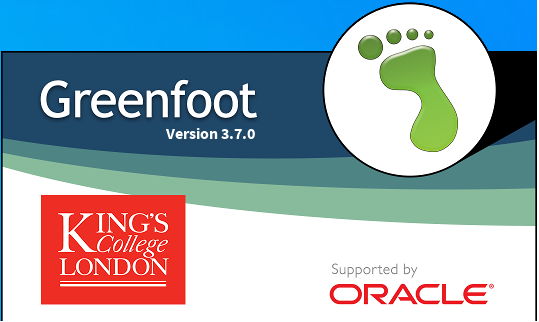

# Projekt "Go Cheezy" Klasse 11, Halbjahr 1

Ein Projekt von Melina Safari und Lionora Ajvazi

## Inhaltsverzeichnis
[Stundenprotokolle](#Stundenprotokolle)

[Programm](#Programm)

[Levels](#Levels)

## Stundenprotokolle   

## 22. August 2022 
In dieser Stunde haben wir, Lionora und Melina uns zu einem Team zusammengetan und uns mit GitHub beschäftigt. Wir haben uns ein Konto angelegt und unsere ersten Erfahrungen mit GitHub gemacht. Außerdem haben wir uns erste Gedanken über unser Projekt gemacht und besprochen, um was für eine Art von Projekt es sich handeln soll. Wir haben beschlossen, uns zu Hause weitere Gedanken über unser Projekt zu machen und mit der recherche fortzufahren, um unsere Ideen in der nächsten Stunde zusammenzufügen. 

## 25. August 2022
Heute haben wir uns darauf geeinigt, ein Spiel zu programmieren und benutzen dafür das Programm Greenfoot. Bei dem Spiel soll es sich um eine Maus handeln, welche in einem Labyrinth nach einem Stück Käsekuchen sucht. Wir haben uns verschiedene Tutorials angeschaut und uns mit verschiedenen Szenarien auf greenfoot vertraut gemacht. 

## 29. August 2022 
Wir haben uns Gedanken zur Optik und zum Design unseres Spieles gemacht und unsere Gedanken zusammengefügt. Wir haben unsere Ausgangsidee durchgesetzt und uns dementsprechend für eine Maus entschieden, welche in einem Labyrinth nach einem Käsekuchen sucht und verschiedene Levels mit steigenden Schwierigkeitsgraden überqueren muss.  

## 05. September 2022
Heute haben wir das erste Level unseres Spieles angefangen und haben schon einmal ein Labyrinth erstellt. Dementsprechend sind wir mit dem Design des ersten Levels fast fertig geworden. 

## 08. September 2022
In dieser Stunde haben wir die Funktionen der Tasten programmiert, sodass die Maus sich nach oben, unten, links und rechts bewegen kann. 

## 12. September 2022
Heute haben wir weitere Funktionen programmiert, welche zur Steuerung der Maus dienen. Außerdem haben wir uns mit weiteren Funktionen vertraut gemacht. 

## 19. September 2022
In dieser Stunde haben wir uns weitere Schwierigkeitsgrade überlegt für die weiteren Levels. Wir haben unsere Gedanken zusammengefügt und besprochen, welche Schwierigkeiten in den nächsten Levels unseres Spieles auftauchen sollten. Außerdem haben wir uns Bilder ausgesucht, welche wir für unser Projekt benutzen wollen. 

## 22. September 2022
Heute haben wir den übergang vom ersten Level in das zweite Level programmiert. Außerdem haben wir weiter am unserem gesamten Projekt gearbeitet und weitere Bilder eingefügt. 

## 26. September 2022 
In dieser Stunde haben wir uns in dem Buch "Einführung in Java mit Greenfoot" anleitungen zur programmierung des zweiten Levels angeguckt. Ausßerdem haben wir weiter an unserem gesamtem Projekt gearbeitet. 

## 06. Oktober 2022 
Heute haben wir in unserem Blog weiter geschrieben und uns mit dem Quelltext für das Spiel beschäftigt. Wir arbeiten nun daran, neue Sachen, beziehungsweise Funktionen zu programmieren. 

## 24. Oktober 2022 
In dieser Stunde hatten wir Schwierigkeiten zur programmierung des zweiten Levels und es sind einige Komplikationenn aufgetaucht, weswegen wir Hilfe bei Herrn Buhl gesucht haben.  

## 03. November 2022
In der heutigen Stunde haben wir entsprechend des zweiten Levels Ameisen programmiert, welche den Weg der Maus sozusagen blockieren. Nun müssen wir weiter daran arbeiten und weitere Funktionen programmieren, um das zweite Level zu vollenden. 

## 07. November 2022

## Programm  
Wir haben uns die Programme "Snap!" und "Greenfoot" angeguckt, welche uns nach Herrn Buhls Empfehlung gut zur programmierung eines Spieles helfen könnten. Wir haben uns zu beiden Programmen näher informiert und kamen zu dem Entschluss, dass Greenfoot übersichtlicher ist und optimal zu unserer Idee/ Vorstellung passt. Außerdem eignet sich das Programm besonders gut für Anfänger. So haben wir angefangen, uns ausführliche Tutorials zu dem Programm "Greenfoot" anzuschauen und kamen unserer Idee immer näher. 

## Levels 
Level 1 :

Für das erste Level haben wir uns einen sehr leichten Schwierigkeitsgrad überlegt, bei dem man nur durch das Labyrinth zum Käsekuchen gelangen muss. Es gibt drei Möglichkeiten. Ganz oben befindet sich eine Packung Pommes, welche die Maus nicht isst, dadrunter ist der Käsekuchen blockiert und ganz unten kann die Maus ohne Probleme zum Käsekuchen gelangen. Wenn die Maus den Käsekuchen berührt, verschwindet dieser und die Maus hat ihn sozusagen aufgegessen. 

